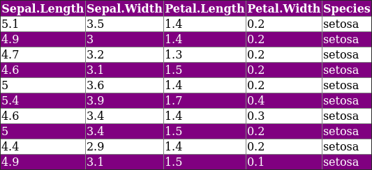
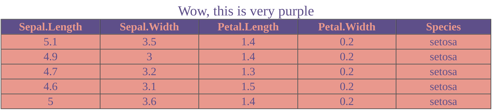
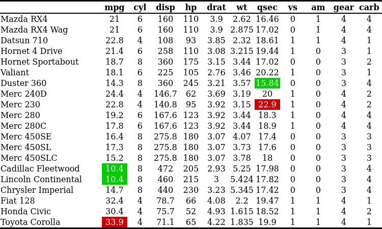

---
#search and replace:
# !\[\]\((.*)\)
# ```{r, eval = TRUE, echo = FALSE, out.width = "100%", fig.align = "left"}\nknitr::include_graphics("\1")\n```
# OLD:  ```{r, eval = TRUE, echo = FALSE}\ngrid::grid.raster(png::readPNG("\1"))\n```
# use {.smaller} after title for single slides

    # 'f' enable fullscreen mode
    # 'w' toggle widescreen mode
    # 'o' enable overview mode
    # 'h' enable code highlight mode
    # 'p' show presenter notes
#
# two-column layout:
#   ## title {.columns-2}
#  or:
#   <div class="columns-2">  </div>
#  or:
#   <div style="float: left; width: 50%;"> </div>  ## awesome! might need a <div> </div> before the columns... (only "left" also works)
#   <div></div> <div style="float: left; width: 50%;"> </div> <div style="float: left; width: 50%;"> </div> 
# color:
#   <div class="red2"></div>
#   <font color="red">
#
# slide layout: after title, place:
#   {.flexbox .vcenter}
#   { .smaller}
#   
---


```{r include=FALSE}
knitr::opts_chunk$set(echo = TRUE)
library(tableHTML)
```


# Add CSS customizations

## Add CSS customizations
- The `add_css_...` family of functions adds inline CSS to the HTML table.
    - `add_css_header`
    - `add_css_seconder_header`
    - `add_css_thead` (headers and second headers)
    - `add_css_tbody` (to all table apart from the headers and second headers.)
    - `add_css_table`
    - `add_css_caption`
    - `add_css_footer`
    - `add_css_row`
    - `add_css_column`
    - `add_css_conditional_column`

## Add CSS customizations
- The CSS code is added within the HTML table.

<div style="float: left; width: 50%;"> 
```{r, eval = TRUE, echo = FALSE, out.width = "100%", fig.align = "left"}
knitr::include_graphics("img/css_col.png")
```

```{r, eval = TRUE, echo = FALSE, out.width = "100%", fig.align = "left"}

```
</div>

<div style="float: left; width: 45%; margin-left: 30px"> 
- stylize columns
```{r eval = FALSE}
iris %>% 
    head(10) %>% 
    tableHTML(rownames = FALSE) %>%
    add_theme('scientific') %>% 
    add_css_column(
        css = list(c('background-color', 'color'),
                   c('gray', 'white')),
        columns = 'Species') 
```

- stylize rows
```{r eval = FALSE}
iris %>% 
    head(10) %>% 
    tableHTML(rownames = FALSE) %>%
    add_css_row(
        css = list(c('background-color', 'color'),
                   c('purple', 'white')),
        rows = odd(1:nrow(iris))) 
```
</div>

## Add CSS customizations
- Users can chain as many functions as needed when building the table.

```{r eval = FALSE}
iris %>% 
    head(5) %>% 
    tableHTML(rownames = FALSE, 
              caption = "Wow, this is very purple",
              widths = rep(150, ncol(iris)))  %>%
    add_css_thead(css = list(c('background-color', 'color'), 
                          c('#5F4B8BFF', '#E69A8DFF'))) %>%
    add_css_tbody(css = list(c('background-color', 'color', 'text-align'), 
                          c('#E69A8DFF', '#5F4B8BFF', 'center'))) %>% 
    add_css_caption(css=list(c('font-size', 'color'), c('20', '#5F4B8BFF')))
```

```{r, eval = TRUE, echo = FALSE, out.width = "100%", fig.align = "left"}

```

## Add CSS customizations
- Cool sub-family `add_css_conditional_column()` 

<div style="float: left; width: 50%;"> 
<br>
```{r, eval = TRUE, echo = FALSE, out.width = "100%", fig.align = "left"}

```
</div>


<div style="float: left; width: 45%; margin-left: 30px"> 
<br>
```{r eval = FALSE}
mtcars %>% 
  head(15) %>% 
  tableHTML(widths = c(150, rep(50, 11))) %>% 
  add_theme('scientific') %>% 
  add_css_conditional_column(
      columns = c('mpg', 'qsec'), 
      conditional = 'max', 
      css = list(c('background', 'color'),
                 c('#cc0000', '#ffffff')), 
      same_scale = FALSE)%>% 
  add_css_conditional_column(
      columns = c('mpg', 'qsec'), 
      conditional = 'min', 
      css = list(c('background', 'color'), 
                 c('#00cc00', '#ffffff')),
      same_scale = FALSE)
```
</div>

## Add CSS customizations
- Cool sub-family `add_css_conditional_column()` 

<div style="float: left; width: 50%;"> 
<br>
```{r, eval = TRUE, echo = FALSE, out.width = "100%", fig.align = "left"}
knitr::include_graphics("img/conditional_css_2.png")
```
</div>

<div style="float: left; width: 45%; margin-left: 30px"> 
<br>
```{r eval = FALSE}
mtcars %>% 
  head(15) %>% 
  tableHTML(widths = c(150, rep(50, 11))) %>% 
  add_theme('scientific') %>% 
  add_css_conditional_column(
      columns = c('disp'), 
      conditional = 'color_rank',
      color_rank_theme = 'White-Blue')%>% 
  add_css_conditional_column(
      columns = c('hp'), 
      conditional = 'color_rank',
      color_rank_theme = 'White-Red') 
```
</div>

## Add CSS customizations
- For complex CSS-styles, it is advised to use a separate CSS file.
- The function `make_css()` helps create css files
- However this is more relevant when using tableHTML with shiny

<br>

```{r eval = FALSE}
make_css(list('table', c('text-align', 'font-size'), c('center', '20px')),
         list('th', c('background-color', 'height'), c('lightgreen', '30px')))

# table {
#   text-align: center;
#   font-size: 20px;
# }
# 
# th {
#   background-color: lightgreen;
#   height: 30px;
```
