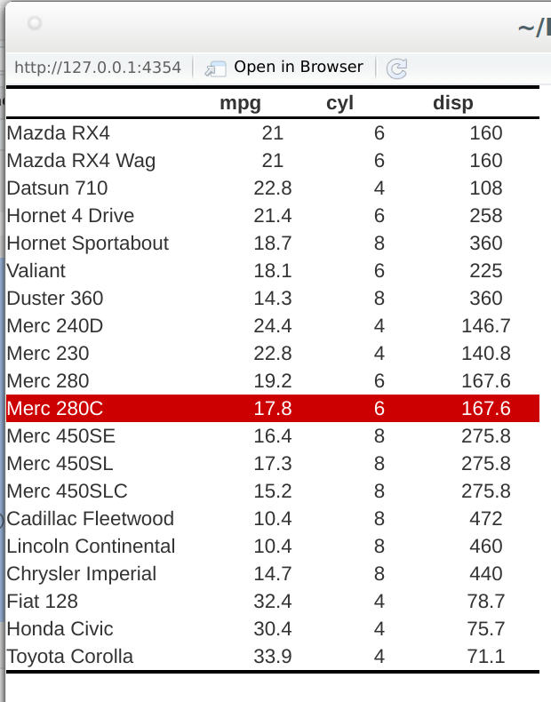

---
#search and replace:
# !\[\]\((.*)\)
# ```{r, eval = TRUE, echo = FALSE, out.width = "100%", fig.align = "left"}\nknitr::include_graphics("\1")\n```
# OLD:  ```{r, eval = TRUE, echo = FALSE}\ngrid::grid.raster(png::readPNG("\1"))\n```
# use {.smaller} after title for single slides

    # 'f' enable fullscreen mode
    # 'w' toggle widescreen mode
    # 'o' enable overview mode
    # 'h' enable code highlight mode
    # 'p' show presenter notes
#
# two-column layout:
#   ## title {.columns-2}
#  or:
#   <div class="columns-2">  </div>
#  or:
#   <div style="float: left; width: 50%;"> </div>  ## awesome! might need a <div> </div> before the columns... (only "left" also works)
#   <div></div> <div style="float: left; width: 50%;"> </div> <div style="float: left; width: 50%;"> </div> 
# color:
#   <div class="red2"></div>
#   <font color="red">
#
# slide layout: after title, place:
#   {.flexbox .vcenter}
#   { .smaller}
#   
---


```{r include=FALSE}
knitr::opts_chunk$set(echo = TRUE)
library(tableHTML)
```


# Shiny

## Shiny{.smaller}
- tableHTML objects can be used in shiny with the functions `render_tableHTML` and `tableHTML_output`

<div style="float: left; width: 50%;"> 
<br>
```{r eval = FALSE}
ui <- fluidPage(
  fluidRow(
    column(width = 2,
           selectInput('df', 'Select Data', 
                       choices = c('mtcars', 'iris'),
                       selected = 'mtcars')
    ),
    column(width = 10,
           tableHTML_output('mytable')
    )
  )
)
server <- function(input, output){
  my_data <- reactive(get(input$df))
  
  output$mytable <- render_tableHTML(
    tableHTML(my_data()[1:3] %>% 
                head(20), 
              widths = c(150, rep(75, 3))) %>% 
      add_theme('scientific')
  )
}

shinyApp(ui, server)
```
</div>

<div style="float: left; width: 50%;"> 
```{r, eval = TRUE, echo = FALSE, out.width = "100%", fig.align = "left"}
knitr::include_graphics("img/shiny_1.png")
```
</div>

## Shiny
- Creating and using external css files with `make_css()`
<div style="float: left; width: 50%;"> 
<br>
```{r eval = FALSE}
make_css(list('tr:hover', 
              c('background-color', 'color'), 
              c('#cc0000', 'white')), 
         file = '../mycss.css')
``` 

```{r eval = FALSE}
ui <- fluidPage(
  fluidRow(
           includeCSS('../mycss.css'),
           tableHTML_output('mytable')
    )
  )

server <- function(input, output){
  output$mytable <- render_tableHTML(
    tableHTML(mtcars[1:3] %>% 
                head(20), 
              widths = c(150, rep(75, 3))) %>% 
      add_theme('scientific')
  )
}

shinyApp(ui, server)
```
</div>

<div style="float: left; width: 50%;"> 
```{r, eval = TRUE, echo = FALSE, out.width = "100%", fig.align = "left"}

```
</div>