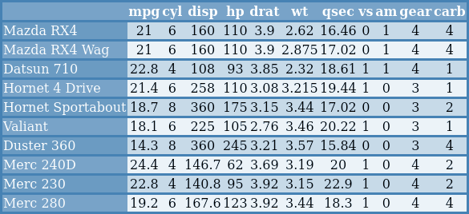

---
#search and replace:
# !\[\]\((.*)\)
# ```{r, eval = TRUE, echo = FALSE, out.width = "100%", fig.align = "left"}\nknitr::include_graphics("\1")\n```
# OLD:  ```{r, eval = TRUE, echo = FALSE}\ngrid::grid.raster(png::readPNG("\1"))\n```
# use {.smaller} after title for single slides

    # 'f' enable fullscreen mode
    # 'w' toggle widescreen mode
    # 'o' enable overview mode
    # 'h' enable code highlight mode
    # 'p' show presenter notes
#
# two-column layout:
#   ## title {.columns-2}
#  or:
#   <div class="columns-2">  </div>
#  or:
#   <div style="float: left; width: 50%;"> </div>  ## awesome! might need a <div> </div> before the columns... (only "left" also works)
#   <div></div> <div style="float: left; width: 50%;"> </div> <div style="float: left; width: 50%;"> </div> 
# color:
#   <div class="red2"></div>
#   <font color="red">
#
# slide layout: after title, place:
#   {.flexbox .vcenter}
#   { .smaller}
#   
---


```{r , include=FALSE}
knitr::opts_chunk$set(echo = TRUE)
library(tableHTML)
```

# Themes 
<!-- {data-background="img/footballer_1.png"} -->

## Themes

- The package was built to give the users, the absolute freedom to design their own HTML tables, 
<br>
- however, pre-defined themes are available for a fast stylization.
<br>
- Currently three main themes are available, and they can be added with the function `add_theme()`
<br>

## Themes
<div style="float: left; width: 50%;"> 
- `scientific`
```{r eval=FALSE}
mtcars %>% 
  head(10) %>% 
  tableHTML() %>% 
  add_theme('scientific')
```

<br>
<br>

- `rshiny-blue`
```{r eval=FALSE}
mtcars %>% 
  head(10) %>% 
  tableHTML() %>% 
  add_theme('rshiny-blue')
```
</div>

<div style="float: right; width: 50%;"> 

```{r, eval = TRUE, echo = FALSE, out.width = "100%", fig.align = "left"}
knitr::include_graphics("img/sci_theme.png")
```

```{r, eval = TRUE, echo = FALSE, out.width = "100%", fig.align = "left"}
knitr::include_graphics("img/shiny_theme.png")
```
</div>

## Themes
<div style="float: left; width: 50%;"> 
- `colorize`

```{r eval=FALSE}
mtcars %>% 
  head(10) %>% 
  tableHTML() %>% 
  add_theme('colorize')
```

<br>
<br>
<br>

- `colorize` can also be customized, when added with the function `add_theme_colorize()`

<br>

```{r eval=FALSE}
mtcars %>% 
  head(10) %>% 
  tableHTML() %>% 
  add_theme_colorize(color=c('pink3', 'yellow2'))
```
</div>


<div style="float: right; width: 50%;"> 
```{r, eval = TRUE, echo = FALSE, out.width = "100%", fig.align = "left"}

```

- `colorize` with customized colors

```{r, eval = TRUE, echo = FALSE, out.width = "100%", fig.align = "left"}
knitr::include_graphics("img/color_theme_2.png")
```
</div>

## Themes
- Also with `add_theme_colorize` the user can choose certain rows to highlight
  + e.g.: highlight the sum of quarterly sales

<div style="float: left; width: 60%;"> 
<br>
```{r eval=FALSE, echo = FALSE}
x1 <- sample(1:100, 12)
x2 <- sample(1:100, 12)
x3 <- sample(1:100, 12)
df <- data.frame(Month = month.abb, x1, x2, x3,
                 stringsAsFactors = FALSE)
df_q <- rbind(
  df[1:3, ],
  c('Sum1', sum(x1[1:3]), sum(x2[1:3]), sum(x3[1:3])),
  df[4:6, ],
  c('Sum2', sum(x1[4:6]), sum(x2[4:6]), sum(x3[4:6])),
  df[7:9, ],
  c('Sum3', sum(x1[7:9]), sum(x2[7:9]), sum(x3[7:9])),
  df[10:12, ],
  c('Sum4', sum(x1[10:12]), sum(x2[10:12]), sum(x3[10:12])))
```

```{r eval=FALSE}
df_q %>% head(8)
#    Month  x1  x2  x3
# 1    Jan   2  92  90
# 2    Feb  15  14  62
# 3    Mar  49  95  76
# 4   Sum1  66 201 228
# 5    Apr  51  69  98
# 6    May  38  28  30
# 7    Jun  75  38  24
# 8   Sum2 164 135 152
```

```{r, eval = FALSE}
df_q %>%
  tableHTML(widths = rep(50, 5),
            rownames = FALSE,
            row_groups = list(c(4, 4, 4, 4),
                              c('Q1', 'Q2', 'Q3', 'Q4'))) %>%
  add_theme_colorize(color = '#009999',
                     total_rows = c(4, 8, 12, 16))
```


</div>

<div style="float: right; width: 30%;"> 
```{r, eval = TRUE, echo = FALSE, out.width = "100%", fig.align = "right"}
knitr::include_graphics("img/color_theme_3.png")
```
</div>