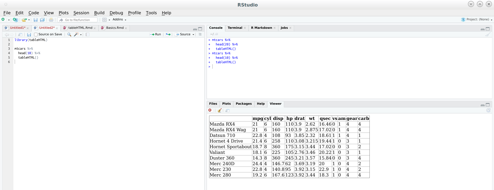

[//]: # (
http://www.w3schools.com/css/css_font.asp
http://www.cssfontstack.com/Helvetica
)

<style>
/* gdbar size (that contains logo) on title page */
/* needs to have greater height than logo image, other stuff is irrelevant */
.gdbar {
  position:absolute !important;
  top: 50px !important; left: auto; right: 0px !important; width: 0px !important;
  height: 500px !important;  /* modify if logo is larger than this in height */
}
/* logo size on title page */
.gdbar img {
  position: absolute; 
  top: 0px;
  left: 110px;
  width:  248px !important;
  height: 275px !important;
}
/*77 64*/
/* logo size on slides */
slides > slide:not(.nobackground):before {
  width: 120px; height: 130px; /* modify width and height (twice) */
  background-size: 124px 137.5px;
  position: absolute; left: auto;
  right: -30px;  /* modify position */
  top: 10px;
}
/* for slides with red background (only works for normal text, not whole slide) {.bgred} */
.bgred,
.bgred div,
.bgred body,
.bgred .article,
.bgred article,
.bgred .prettyprint,
.bgred .h1,
.bgred .h2,
.bgred .h3,
.bgred backdrop,
.bgred .backdrop,
.bgred .slide,
.bgred slide,
.bgred slides > slide.backdrop {   
  background-color:#ffaaaa;
  background:#ffaaaa;
}
.footer {
    position: fixed;
    top: 70%;
    width:100%;
}
/*slides > slide.backdrop {   */
/*  background-color:#ffaaaa;   */
/*  background:#ffaaaa;   */
/*}   */
</style>

## Contents

- Introduction
- Basic Options
- Themes
- Add CSS customizations
- Shiny


# Introduction

## Introduction: why, what, and how?

- While developing a [football app](https://lyzander.shinyapps.io/FootballeR/) using shiny, it was somewhat difficult to build a pretty HTML table
  + Example: drawing vertival lines every three columns seemd like a difficult task
  + even using great packages like `xtable`
- Development started in 2016
- tableHTML is a package for building CSS-ible HTML tables in an easy and intuitive way
- Compatible with any application that accepts HTML (e.g. shiny, rmarkdown, Outlook, PowerPoint, Word)


## Introduction
<div style="float: left; width: 50%;"> 
- The main function tableHTML converts a data.frame or matrix or any other object that can be converted into a data.frame into an HTML table

<br> 


```r
mtcars[,1:3] %>% head(2)
#               mpg cyl disp
# Mazda RX4      21   6  160
# Mazda RX4 Wag  21   6  160
```
</div>

<div style="float: left; width: 50%;">

```html
<table style="border-collapse:collapse;" 
        class=table_4805 border=1>
<thead>
<tr>
  <th id="tableHTML_header_1"> </th>
  <th id="tableHTML_header_2">mpg</th>
  <th id="tableHTML_header_3">cyl</th>
  <th id="tableHTML_header_4">disp</th>
</tr>
</thead>
<tbody>
<tr>
  <td id="tableHTML_rownames">Mazda RX4</td>
  <td id="tableHTML_column_1">21</td>
  <td id="tableHTML_column_2">6</td>
  <td id="tableHTML_column_3">160</td>
</tr>
<tr>
  <td id="tableHTML_rownames">Mazda RX4 Wag</td>
  <td id="tableHTML_column_1">21</td>
  <td id="tableHTML_column_2">6</td>
  <td id="tableHTML_column_3">160</td>
</tr>
</tbody>
</table>
```
</div>

## Introduction

- Using the function on R Studio will print the table on the viewer otherwise it will use the default browser, and 

- the default tables are built without any CSS in order to allow for full flexibility.



## Introduction
<div style="float: left; width: 50%;"> 
- The package was developed so that the functions are chained with the `%>%` (pipe) operator, exported from the package `magrittr`

<br>

- Tables can be exported as images using `tableHTML_to_image()`

<br>


```r
mtcars %>% 
  tableHTML(widths = c(200, rep(50, 11))) %>% 
  add_theme('scientific') %>% 
  tableHTML_to_image(file = 'img/tableHTML_to_image.png')
```

<!-- -->
</div>

<div style="float: right; width: 50%;"> 

</div>


# Basic Options


## Basic Options
- Right out of the bat the function `tableHTML()` offers a lot options to customize your table.

<div style="float: left; width: 45%; font-size: 80%; margin-left: 30px"> 
  + Add a CSS class `class`
  + Change the width of the columns `width`
  + Adjust the thickness of the external borders `border` 
<br>
<br>


```r
mtcars %>% 
  head(20) %>% 
  tableHTML(class = 'table_0034', 
            widths = c(200, rep(50, ncol(mtcars))), 
            border = 10)
```
</div>

<div style="float: right; width: 50%;"> 

</div>
  


## Basic Options
- Right out of the bat the function `tableHTML()` offers a lot options to customize your table.

<div style="float: left; width: 45%; font-size: 80%; margin-left: 30px"> 
  + Add a second header `second_header`
  + Add/remove row names `rownames`
  + Add row groups `row_groups`
<br>
<br>


```r
mtcars %>% 
  head(20) %>% 
  tableHTML(second_headers = 
              list(c(3, 4, 5), 
                   c('col1', 'col2', 'col3')),
            rownames = FALSE,
            row_groups = 
              list(c(10, 10), 
                   c('Group 1', 'Group 2')),
            widths = c(100, rep(50, ncol(mtcars))), 
            border = 10)
```
</div>

<div style="float: right; width: 50%;"> 

</div>

## Basic Options
- Right out of the bat the function `tableHTML()` offers a lot options to customize your table.

<div style="float: left; width: 45%; font-size: 80%; margin-left: 30px"> 
  + Round numeric columns `round`
  + Fill missing values `replace_NA`
  + Add a caption above the table `caption`
  + Add a footer `footer`
  + Adjust the spacing between the cells of the table `collapse`, `spacing`
<br>
<br>


```r
mtcars %>% 
  head(15) %>% 
  tableHTML(round=0,
            caption = 
              "This is the mtcars dataset",
            footer = 
              "Maybe we should've used iris", 
            collapse = 'separate')
```
</div>

<div style="float: right; width: 50%; "> 

</div>


# Themes 
<!-- {data-background="img/footballer_1.png"} -->

## Themes

- The package was built to give the users, the absolute freedom to design their own HTML tables, 
<br>
- however, pre-defined themes are available for a fast stylization.
<br>
- Currently three main themes are available, and they can be added with the function `add_theme()`
<br>

## Themes
<div style="float: left; width: 50%;"> 
- `scientific`

```r
mtcars %>% 
  head(10) %>% 
  tableHTML() %>% 
  add_theme('scientific')
```

<br>
<br>

- `rshiny-blue`

```r
mtcars %>% 
  head(10) %>% 
  tableHTML() %>% 
  add_theme('rshiny-blue')
```
</div>

<div style="float: right; width: 50%;"> 


</div>

## Themes
<div style="float: left; width: 50%;"> 
- `colorize`


```r
mtcars %>% 
  head(10) %>% 
  tableHTML() %>% 
  add_theme('colorize')
```

<br>
<br>
<br>

- `colorize` can also be customized, when added with the function `add_theme_colorize()`

<br>


```r
mtcars %>% 
  head(10) %>% 
  tableHTML() %>% 
  add_theme_colorize(color=c('pink3', 'yellow2'))
```
</div>


<div style="float: right; width: 50%;"> 


- `colorize` with customized colors


</div>

## Themes
- Also with `add_theme_colorize` the user can choose certain rows to highlight
  + e.g.: highlight the sum of quarterly sales

<div style="float: left; width: 60%;"> 
<br>


```r
df_q %>% head(8)
#    Month  x1  x2  x3
# 1    Jan   2  92  90
# 2    Feb  15  14  62
# 3    Mar  49  95  76
# 4   Sum1  66 201 228
# 5    Apr  51  69  98
# 6    May  38  28  30
# 7    Jun  75  38  24
# 8   Sum2 164 135 152
```


```r
df_q %>%
  tableHTML(widths = rep(50, 5),
            rownames = FALSE,
            row_groups = list(c(4, 4, 4, 4),
                              c('Q1', 'Q2', 'Q3', 'Q4'))) %>%
  add_theme_colorize(color = '#009999',
                     total_rows = c(4, 8, 12, 16))
```


</div>

<div style="float: right; width: 30%;"> 

</div>


# Add CSS customizations

## Add CSS customizations
- The `add_css_...` family of functions adds inline CSS to the HTML table.
    - `add_css_header`
    - `add_css_seconder_header`
    - `add_css_thead` (headers and second headers)
    - `add_css_tbody` (to all table apart from the headers and second headers.)
    - `add_css_table`
    - `add_css_caption`
    - `add_css_footer`
    - `add_css_row`
    - `add_css_column`
    - `add_css_conditional_column`

## Add CSS customizations
- The CSS Code is added within the HTML table.

<div style="float: left; width: 50%;"> 


</div>

<div style="float: left; width: 45%; margin-left: 30px"> 
- stylize columns

```r
iris %>% 
    head(10) %>% 
    tableHTML(rownames = FALSE) %>%
    add_theme('scientific') %>% 
    add_css_column(
        css = list(c('background-color', 'color'),
                   c('gray', 'white')),
        columns = 'Species') 
```

- stylize rows

```r
iris %>% 
    head(10) %>% 
    tableHTML(rownames = FALSE) %>%
    add_css_row(
        css = list(c('background-color', 'color'),
                   c('purple', 'white')),
        rows = odd(1:nrow(iris))) 
```
</div>

## Add CSS customizations
- The user can chain as many functions as needed when building the table.


```r
iris %>% 
    head(5) %>% 
    tableHTML(rownames = FALSE, 
              caption = "5 rows from the iris dataset",
              widths = rep(150, ncol(iris)))  %>%
    add_css_thead(css = list(c('background-color', 'color'), 
                          c('#5F4B8BFF', '#E69A8DFF'))) %>%
    add_css_tbody(css = list(c('background-color', 'color', 'text-align'), 
                          c('#E69A8DFF', '#5F4B8BFF', 'center'))) %>% 
    add_css_caption(css=list(c('font-size', 'color'), c('20', '#5F4B8BFF')))
```


## Add CSS customizations
- Cool sub-family `add_css_conditional_column()` 

<div style="float: left; width: 50%;"> 
<br>

</div>


<div style="float: left; width: 45%; margin-left: 30px"> 
<br>

```r
mtcars %>% 
  head(15) %>% 
  tableHTML(widths = c(150, rep(50, 11))) %>% 
  add_theme('scientific') %>% 
  add_css_conditional_column(
      columns = c('mpg', 'qsec'), 
      conditional = 'max', 
      css = list(c('background', 'color'),
                 c('#cc0000', '#ffffff')), 
      same_scale = FALSE)%>% 
  add_css_conditional_column(
      columns = c('mpg', 'qsec'), 
      conditional = 'min', 
      css = list(c('background', 'color'), 
                 c('#00cc00', '#ffffff')),
      same_scale = FALSE)
```
</div>

## Add CSS customizations
- Cool sub-family `add_css_conditional_column()` 

<div style="float: left; width: 50%;"> 
<br>

</div>

<div style="float: left; width: 45%; margin-left: 30px"> 
<br>

```r
mtcars %>% 
  head(15) %>% 
  tableHTML(widths = c(150, rep(50, 11))) %>% 
  add_theme('scientific') %>% 
  add_css_conditional_column(
      columns = c('disp'), 
      conditional = 'color_rank',
      color_rank_theme = 'White-Blue')%>% 
  add_css_conditional_column(
      columns = c('hp'), 
      conditional = 'color_rank',
      color_rank_theme = 'White-Red') 
```
</div>

## Add CSS customizations
- For complex CSS-styles, it is advised to use a separate CSS file.
- The function `make_css()` helps create css files
- However this is more relevant when using tableHTML with shiny

<br>


```r
make_css(list('table', c('text-align', 'font-size'), c('center', '20px')),
         list('th', c('background-color', 'height'), c('lightgreen', '30px')))

# table {
#   text-align: center;
#   font-size: 20px;
# }
# 
# th {
#   background-color: lightgreen;
#   height: 30px;
```


# Shiny

## Shiny{.smaller}
- tableHTML objects can be used in shiny with the functions `render_tableHTML` and `tableHTML_output`

<div style="float: left; width: 50%;"> 
<br>

```r
ui <- fluidPage(
  fluidRow(
    column(width = 2,
           selectInput('df', 'Select Data', 
                       choices = c('mtcars', 'iris'),
                       selected = 'mtcars')
    ),
    column(width = 10,
           tableHTML_output('mytable')
    )
  )
)
server <- function(input, output){
  my_data <- reactive(get(input$df))
  
  output$mytable <- render_tableHTML(
    tableHTML(my_data()[1:3] %>% 
                head(20), 
              widths = c(150, rep(75, 3))) %>% 
      add_theme('scientific')
  )
}

shinyApp(ui, server)
```
</div>

<div style="float: left; width: 50%;"> 

</div>

## Shiny
- Creating and using external css files with `make_css()`
<div style="float: left; width: 50%;"> 
<br>

```r
make_css(list('tr:hover', 
              c('background-color', 'color'), 
              c('#cc0000', 'white')), 
         file = '../mycss.css')
```


```r
ui <- fluidPage(
  fluidRow(
           includeCSS('../mycss.css'),
           tableHTML_output('mytable')
    )
  )

server <- function(input, output){
  output$mytable <- render_tableHTML(
    tableHTML(mtcars[1:3] %>% 
                head(20), 
              widths = c(150, rep(75, 3))) %>% 
      add_theme('scientific')
  )
}

shinyApp(ui, server)
```
</div>

<div style="float: left; width: 50%;"> 

</div>

# Thank You
<div style="color: white;">
- If you need help using the package, there is a `tableHTML` tag on stackoverflow:
<br>https://stackoverflow.com/questions/tagged/tablehtml

- If you find any bugs please report them on the issues page on github.
<br>https://github.com/LyzandeR/tableHTML/issues
</div>
